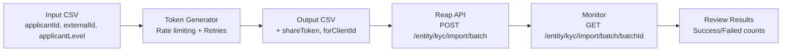

# KYC Share Token Generator

[](https://www.python.org/downloads/)
[](https://opensource.org/licenses/MIT)
[](test_sumsub_share_token_generator.py)

A robust Python CLI tool for generating Sumsub share tokens from CSV data, designed for bulk KYC verification workflows with the Reap KYC Batch Upload API.

## Overview

This tool helps you generate share tokens from Sumsub applicant IDs and prepare CSV files for bulk upload to the Reap KYC Batch Upload API. It handles rate limiting, retries, and error recovery automatically.

## Features

- Generate share tokens from Sumsub applicant IDs
- Handle rate limiting automatically (40 requests per 5 seconds)
- Retry failed requests with exponential backoff
- Resume interrupted processing from the last successful record
- Validate CSV format before processing
- Comprehensive error reporting and logging
- Support for custom Sumsub base URLs and client IDs
- Dry-run mode for testing without API calls
- Comprehensive test suite with 40+ tests

## Quick Start

### Prerequisites

- Python 3.8 or higher
- Sumsub API credentials (App Token and Secret)
- Input CSV with applicant data

### Installation

```bash
# Clone the repository
git clone https://github.com/reaphq/kyc-share-token.git
cd kyc-share-token

# Install dependencies
pip install -r requirements.txt

# Set up environment variables
cp .env.example .env
# Edit .env with your Sumsub credentials
```

### Basic Usage

```bash
# Set environment variables
export SUMSUB_APP_TOKEN="your-app-token-here"
export SUMSUB_SECRET="your-secret-key-here"

# Generate share tokens
python sumsub_share_token_generator.py input.csv output.csv
```

## Input CSV Format

Your input CSV must have the following columns:

| Column | Required | Description | Example |
|--------|----------|-------------|---------|
| `applicantId` | Yes | Sumsub applicant ID | `68c276d1827b5c7a72ec620e` |
| `externalId` | Yes | Your unique entity identifier (UUID) | `ef88fd57-26cf-415d-a112-941732c55350` |
| `applicantLevel` | Yes | Sumsub verification level | `levelKyc` or `basic-kyc-level` |

### Example Input CSV

```csv
applicantId,externalId,applicantLevel
68c276d1827b5c7a72ec620e,ef88fd57-26cf-415d-a112-941732c55350,levelKyc
68c276d1827b5c7a72ec620f,b1234567-89ab-cdef-0123-456789abcdef,levelKyc
68c276d1827b5c7a72ec6210,c9876543-21fe-dcba-9876-543210fedcba,basic-kyc-level
```

See [examples/sample_input.csv](examples/sample_input.csv) for a complete example.

## Output CSV Format

The tool generates a CSV with additional columns:

| Column | Description |
|--------|-------------|
| `applicantId` | Original applicant ID |
| `externalId` | Original external ID |
| `applicantLevel` | Original applicant level |
| `shareToken` | Generated share token (JWT) |
| `forClientId` | Sumsub client ID |
| `error` | Error message (if generation failed) |

### Example Output CSV

```csv
applicantId,externalId,applicantLevel,shareToken,forClientId,error
68c276d1827b5c7a72ec620e,ef88fd57-26cf-415d-a112-941732c55350,levelKyc,eyJhbGciOiJIUzI1NiIsInR5cCI6IkpXVCJ9...,your-client-id,
68c276d1827b5c7a72ec620f,b1234567-89ab-cdef-0123-456789abcdef,levelKyc,eyJhbGciOiJIUzI1NiIsInR5cCI6IkpXVCJ9...,your-client-id,
68c276d1827b5c7a72ec6210,c9876543-21fe-dcba-9876-543210fedcba,levelKyc,,,"Applicant not found"
```

See [examples/sample_output.csv](examples/sample_output.csv) for a complete example.

## Environment Variables

| Variable | Required | Default | Description |
|----------|----------|---------|-------------|
| `SUMSUB_APP_TOKEN` | Yes | - | Your Sumsub App Token |
| `SUMSUB_SECRET` | Yes | - | Your Sumsub Secret Key |
| `SUMSUB_BASE_URL` | No | `https://api.sumsub.com` | Sumsub API base URL |
| `SUMSUB_CLIENT_ID` | No | Extracted from token | Sumsub client ID |

See [.env.example](.env.example) for a template.

## Advanced Usage

### Command-Line Options

```bash
python sumsub_share_token_generator.py [options] input.csv output.csv

Options:
  -h, --help            Show help message
  --dry-run             Validate CSV without making API calls
  --resume              Resume processing from last successful record
  --rate-limit N        Custom rate limit (requests per 5 seconds, default: 40)
  --base-url URL        Custom Sumsub base URL
  --client-id ID        Custom Sumsub client ID
```

### Examples

**Dry Run (Validation Only)**
```bash
python sumsub_share_token_generator.py --dry-run input.csv output.csv
```

**Resume Interrupted Processing**
```bash
python sumsub_share_token_generator.py --resume input.csv output.csv
```

**Custom Rate Limit**
```bash
python sumsub_share_token_generator.py --rate-limit 20 input.csv output.csv
```

**Custom Base URL**
```bash
python sumsub_share_token_generator.py --base-url https://api.custom.sumsub.com input.csv output.csv
```

## Integration with Reap KYC Batch Upload

After generating share tokens, upload the output CSV to the Reap KYC Batch Upload API:

### Using cURL

```bash
curl -X POST https://api.reap.global/entity/kyc/import/batch \
  -H "Authorization: COMPLIANCE_API_KEY" \
  -H "X-Provider: sumsub" \
  -H "Idempotency-Key: batch-$(date +%s)-$(uuidgen)" \
  -F "file=@output.csv"
```

### Using JavaScript/Node.js

```javascript
const FormData = require('form-data');
const fs = require('fs');
const crypto = require('crypto');

const form = new FormData();
form.append('file', fs.createReadStream('./output.csv'));

const response = await fetch('https://api.reap.global/entity/kyc/import/batch', {
  method: 'POST',
  headers: {
    'Authorization': 'COMPLIANCE_API_KEY',
    'X-Provider': 'sumsub',
    'Idempotency-Key': `batch-${new Date().toISOString()}-${crypto.randomUUID()}`,
    ...form.getHeaders()
  },
  body: form
});

const result = await response.json();
console.log(`Batch ID: ${result.batchId}`);
```

For detailed integration instructions, see [docs/INTEGRATION.md](docs/INTEGRATION.md).

## Error Handling

The tool handles various error scenarios:

- **Rate Limiting**: Automatically throttles requests to 40 per 5 seconds
- **Network Errors**: Retries with exponential backoff (up to 3 attempts)
- **Invalid Applicant IDs**: Logs error and continues with remaining records
- **Missing Credentials**: Validates environment variables before processing
- **Invalid CSV Format**: Validates headers and data before API calls

All errors are logged to console and written to the output CSV for review.

## Testing

Run the comprehensive test suite:

```bash
python test_sumsub_share_token_generator.py
```

The test suite includes 40+ tests covering:
- CSV validation
- Share token generation
- Rate limiting
- Error handling
- Resume functionality
- API integration

## Performance

- **Processing Speed**: Up to 40 records per 5 seconds (480 per minute)
- **Memory Usage**: Minimal (streams CSV data row by row)
- **Scalability**: Can handle files with thousands of records

### Benchmarks

| Records | Estimated Time |
|---------|----------------|
| 100 | 15 seconds |
| 1,000 | 2.5 minutes |
| 5,000 | 12 minutes |
| 10,000 | 25 minutes |

*Note: Processing time depends on network latency and Sumsub API response times.*

## Use Cases

1. **Bulk KYC Migration**: Migrate existing Sumsub applicants to Reap platform
2. **Batch Verification**: Verify hundreds or thousands of entities in one operation
3. **Data Synchronization**: Keep KYC data in sync between systems
4. **Testing**: Generate test data for KYC workflows

## Workflow



## Troubleshooting

### Common Issues

**Error: "Missing required environment variables"**
- Ensure `SUMSUB_APP_TOKEN` and `SUMSUB_SECRET` are set
- Check `.env` file or export variables manually

**Error: "Invalid CSV format"**
- Verify headers: `applicantId`, `externalId`, `applicantLevel` (case-sensitive)
- Ensure UTF-8 encoding without BOM
- Remove empty rows

**Error: "Rate limit exceeded"**
- The tool handles this automatically with delays
- If persistent, reduce `--rate-limit` value

**Error: "Applicant not found"**
- Verify applicant ID exists in Sumsub
- Check Sumsub credentials and permissions

For more troubleshooting tips, see the [FAQ](docs/INTEGRATION.md#faq).

## Contributing

Contributions are welcome! Please see [CONTRIBUTING.md](CONTRIBUTING.md) for guidelines.

## License

This project is licensed under the MIT License - see the [LICENSE](LICENSE) file for details.

## Support

- **Documentation**: [docs/](docs/)
- **Issues**: [GitHub Issues](https://github.com/reaphq/kyc-share-token/issues)
- **Integration Guide**: [docs/INTEGRATION.md](docs/INTEGRATION.md)

## Changelog

See [CHANGELOG.md](CHANGELOG.md) for version history.

---

**Maintained by**: [Reap Technologies Pte. Ltd.](https://reap.global)

**Related Projects**:
- [Reap API Documentation](https://reap-ra.readme.io/)
- [KYC Batch Upload User Guide](https://reap-ra.readme.io/docs/upload-kyc-batch-user-guide)
