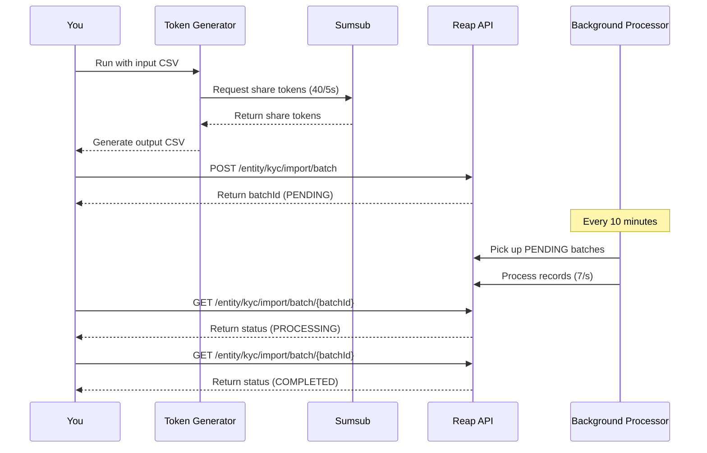
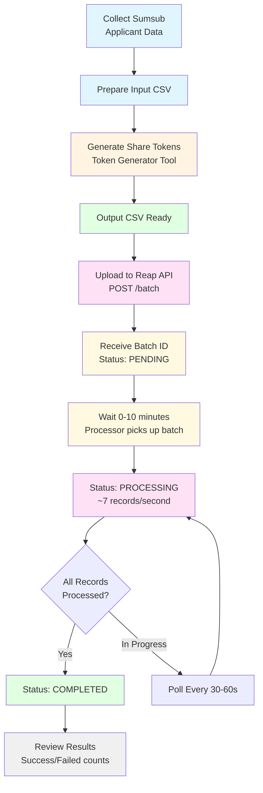

# Integration Guide - Reap KYC Batch Upload API

This guide provides complete instructions for integrating the KYC Share Token Generator with the Reap KYC Batch Upload API.

## Table of Contents

1. [Overview](#overview)
2. [End-to-End Workflow](#end-to-end-workflow)
3. [Step-by-Step Integration](#step-by-step-integration)
4. [Code Examples](#code-examples)
5. [Best Practices](#best-practices)
6. [Troubleshooting](#troubleshooting)
7. [FAQ](#faq)

## Overview

The integration involves three main steps:

1. **Generate Share Tokens**: Use this tool to generate Sumsub share tokens from applicant IDs
2. **Upload Batch**: Submit the generated CSV to Reap KYC Batch Upload API
3. **Monitor Progress**: Poll the API to track batch processing status



## End-to-End Workflow

### Complete Workflow Diagram



## Step-by-Step Integration

### Prerequisites

Before you begin:

1. **Sumsub Access**: Valid Sumsub API credentials (App Token and Secret)
2. **Reap API Access**: Valid Reap API authentication token
3. **Existing Entities**: All entities must already exist in Reap system
4. **Python Environment**: Python 3.8+ with dependencies installed

### Step 1: Collect Applicant Data

Gather your Sumsub applicant data in CSV format:

```csv
applicantId,externalId,applicantLevel
68c276d1827b5c7a72ec620e,ef88fd57-26cf-415d-a112-941732c55350,levelKyc
68c276d1827b5c7a72ec620f,b1234567-89ab-cdef-0123-456789abcdef,levelKyc
```

**Data Sources**:
- Sumsub Dashboard: Export applicant list
- Sumsub API: Query applicants via API
- Your Database: Join entity IDs with Sumsub applicant IDs

### Step 2: Generate Share Tokens

Run the token generator:

```bash
# Set environment variables
export SUMSUB_APP_TOKEN="your-app-token"
export SUMSUB_SECRET="your-secret-key"

# Generate tokens
python sumsub_share_token_generator.py input.csv output.csv

# Expected output:
# Processing 1000 records...
# Rate limiting: 40 requests per 5 seconds
# Progress: 200/1000 records processed...
# Progress: 400/1000 records processed...
# ...
# Completed: 995 successful, 5 failed
# Output saved to: output.csv
```

**Output CSV Structure**:
```csv
externalId,shareToken,applicantLevel
ef88fd57-26cf-415d-a112-941732c55350,eyJhbGci...,levelKyc
b1234567-89ab-cdef-0123-456789abcdef,eyJhbGci...,levelKyc
```

Note: The batch upload API expects `externalId`, `shareToken`, and `applicantLevel` columns (no `applicantId` column).

### Step 3: Upload Batch to Reap API

#### Using cURL

```bash
curl -X POST https://api.reap.global/entity/kyc/import/batch \
  -H "Authorization: COMPLIANCE_API_KEY" \
  -H "X-Provider: sumsub" \
  -H "Idempotency-Key: batch-$(date +%s)-$(uuidgen)" \
  -F "file=@output.csv"
```

#### Using JavaScript/Node.js

```javascript
const FormData = require('form-data');
const fs = require('fs');
const crypto = require('crypto');

async function uploadBatch(csvFilePath, apiKey) {
  const form = new FormData();
  form.append('file', fs.createReadStream(csvFilePath));

  const idempotencyKey = `batch-${Date.now()}-${crypto.randomUUID()}`;

  const response = await fetch('https://api.reap.global/entity/kyc/import/batch', {
    method: 'POST',
    headers: {
      'Authorization': apiKey,
      'X-Provider': 'sumsub',
      'Idempotency-Key': idempotencyKey,
      ...form.getHeaders()
    },
    body: form
  });

  if (!response.ok) {
    const error = await response.json();
    throw new Error(`Upload failed: ${error.message}`);
  }

  return await response.json();
}

// Usage
const result = await uploadBatch('./output.csv', process.env.COMPLIANCE_API_KEY);
console.log(`Batch uploaded: ${result.batchId}`);
console.log(`Status: ${result.status}`);
console.log(`Total records: ${result.totalRecords}`);
```

#### Expected Response

```json
{
  "batchId": "784d4045-c900-4050-aad6-8fe4c8d2fb16",
  "businessUuid": "a1234567-89ab-cdef-0123-456789abcdef",
  "status": "PENDING",
  "totalRecords": 1000,
  "message": "File uploaded successfully. Processing will start shortly.",
  "createdAt": "2024-01-15T10:30:00.000Z"
}
```

### Step 4: Monitor Batch Processing

#### Polling Implementation

```javascript
async function pollBatchStatus(batchId, apiKey, options = {}) {
  const {
    pollIntervalMs = 30000,  // 30 seconds
    timeoutMs = 1800000,     // 30 minutes
    onProgress = null
  } = options;

  const startTime = Date.now();

  while (Date.now() - startTime < timeoutMs) {
    const response = await fetch(
      `https://api.reap.global/entity/kyc/import/batch/${batchId}`,
      {
        headers: {
          'Authorization': apiKey
        }
      }
    );

    if (!response.ok) {
      throw new Error(`Status check failed: ${response.status}`);
    }

    const status = await response.json();

    // Call progress callback if provided
    if (onProgress) {
      onProgress(status);
    }

    console.log(
      `Status: ${status.status} | ` +
      `Processed: ${status.processedRecords}/${status.totalRecords} | ` +
      `Failed: ${status.failedRecords}`
    );

    // Check if processing is complete
    if (status.status === 'COMPLETED') {
      console.log(`Batch completed successfully!`);
      console.log(`Successful: ${status.summary.successfulRecords}`);
      console.log(`Failed: ${status.failedRecords}`);
      return status;
    }

    if (status.status === 'FAILED') {
      throw new Error('Batch processing failed');
    }

    // Wait before next poll
    await new Promise(resolve => setTimeout(resolve, pollIntervalMs));
  }

  throw new Error('Batch processing timeout');
}

// Usage
const finalStatus = await pollBatchStatus(
  '784d4045-c900-4050-aad6-8fe4c8d2fb16',
  process.env.COMPLIANCE_API_KEY,
  {
    pollIntervalMs: 30000,
    onProgress: (status) => {
      // Update UI, send notifications, etc.
      console.log(`Progress: ${status.processedRecords}/${status.totalRecords}`);
    }
  }
);
```

#### Expected Status Responses

**While Processing**:
```json
{
  "batchId": "784d4045-c900-4050-aad6-8fe4c8d2fb16",
  "status": "PROCESSING",
  "totalRecords": 1000,
  "processedRecords": 450,
  "failedRecords": 5,
  "createdAt": "2024-01-15T10:30:00.000Z",
  "updatedAt": "2024-01-15T10:42:00.000Z",
  "startedAt": "2024-01-15T10:35:00.000Z",
  "completedAt": null,
  "summary": {
    "successfulRecords": 445,
    "errors": []
  }
}
```

**When Completed**:
```json
{
  "batchId": "784d4045-c900-4050-aad6-8fe4c8d2fb16",
  "status": "COMPLETED",
  "totalRecords": 1000,
  "processedRecords": 995,
  "failedRecords": 5,
  "createdAt": "2024-01-15T10:30:00.000Z",
  "updatedAt": "2024-01-15T10:45:00.000Z",
  "startedAt": "2024-01-15T10:35:00.000Z",
  "completedAt": "2024-01-15T10:45:00.000Z",
  "summary": {
    "successfulRecords": 990,
    "errors": []
  }
}
```

### Step 5: Review Results

After completion, review the results:

```javascript
function analyzeResults(finalStatus) {
  const {
    totalRecords,
    processedRecords,
    failedRecords,
    summary
  } = finalStatus;

  const successRate = (summary.successfulRecords / totalRecords * 100).toFixed(2);

  console.log('Batch Processing Summary');
  console.log('========================');
  console.log(`Total Records: ${totalRecords}`);
  console.log(`Processed: ${processedRecords}`);
  console.log(`Successful: ${summary.successfulRecords} (${successRate}%)`);
  console.log(`Failed: ${failedRecords}`);

  if (failedRecords > 0) {
    console.log('\nAction Required:');
    console.log('- Review failed records in the output CSV');
    console.log('- Check entity requirement status for failed externalIds');
    console.log('- Retry failed records if issues are resolved');
  }
}
```

## Code Examples

### Complete Integration Example

```javascript
const FormData = require('form-data');
const fs = require('fs');
const crypto = require('crypto');

class ReapKycBatchClient {
  constructor(apiKey, apiUrl = 'https://api.reap.global') {
    this.apiKey = apiKey;
    this.apiUrl = apiUrl;
  }

  async uploadBatch(csvFilePath) {
    const form = new FormData();
    form.append('file', fs.createReadStream(csvFilePath));

    const idempotencyKey = `batch-${Date.now()}-${crypto.randomUUID()}`;

    const response = await fetch(`${this.apiUrl}/entity/kyc/import/batch`, {
      method: 'POST',
      headers: {
        'Authorization': this.apiKey,
        'X-Provider': 'sumsub',
        'Idempotency-Key': idempotencyKey,
        ...form.getHeaders()
      },
      body: form
    });

    if (!response.ok) {
      const error = await response.json();
      throw new Error(`Upload failed: ${error.message} (${error.code})`);
    }

    return await response.json();
  }

  async getBatchStatus(batchId) {
    const response = await fetch(
      `${this.apiUrl}/entity/kyc/import/batch/${batchId}`,
      {
        headers: {
          'Authorization': this.apiKey
        }
      }
    );

    if (!response.ok) {
      const error = await response.json();
      throw new Error(`Status check failed: ${error.message}`);
    }

    return await response.json();
  }

  async waitForCompletion(batchId, options = {}) {
    const {
      pollIntervalMs = 30000,
      timeoutMs = 1800000,
      onProgress = null
    } = options;

    const startTime = Date.now();

    while (Date.now() - startTime < timeoutMs) {
      const status = await this.getBatchStatus(batchId);

      if (onProgress) {
        onProgress(status);
      }

      if (status.status === 'COMPLETED' || status.status === 'FAILED') {
        return status;
      }

      await new Promise(resolve => setTimeout(resolve, pollIntervalMs));
    }

    throw new Error('Batch processing timeout');
  }

  async processBatch(csvFilePath, options = {}) {
    console.log('Uploading KYC batch...');
    const uploadResult = await this.uploadBatch(csvFilePath);

    console.log(`✓ Upload successful!`);
    console.log(`  Batch ID: ${uploadResult.batchId}`);
    console.log(`  Total records: ${uploadResult.totalRecords}`);

    console.log('\nWaiting for processing to complete...');
    const finalStatus = await this.waitForCompletion(
      uploadResult.batchId,
      options
    );

    console.log('\nBatch Processing Summary:');
    console.log(`  Status: ${finalStatus.status}`);
    console.log(`  Successful: ${finalStatus.summary.successfulRecords}`);
    console.log(`  Failed: ${finalStatus.failedRecords}`);
    console.log(`  Duration: ${this.calculateDuration(finalStatus)}`);

    return finalStatus;
  }

  calculateDuration(status) {
    if (!status.startedAt || !status.completedAt) {
      return 'N/A';
    }
    const start = new Date(status.startedAt);
    const end = new Date(status.completedAt);
    const durationMs = end - start;
    const minutes = Math.floor(durationMs / 60000);
    const seconds = Math.floor((durationMs % 60000) / 1000);
    return `${minutes}m ${seconds}s`;
  }
}

// Usage Example
async function main() {
  const client = new ReapKycBatchClient(process.env.COMPLIANCE_API_KEY);

  try {
    const result = await client.processBatch('./output.csv', {
      pollIntervalMs: 30000,
      onProgress: (status) => {
        console.log(
          `  Progress: ${status.processedRecords}/${status.totalRecords} ` +
          `(${status.failedRecords} failed)`
        );
      }
    });

    if (result.failedRecords > 0) {
      console.log('\nWarning: Some records failed. Review output CSV for details.');
    }

  } catch (error) {
    console.error('Error:', error.message);
    process.exit(1);
  }
}

main();
```

### Bash Script Example

```bash
#!/bin/bash

set -e

# Configuration
INPUT_CSV="input.csv"
OUTPUT_CSV="output.csv"
COMPLIANCE_API_KEY="${COMPLIANCE_API_KEY}"
API_URL="https://api.reap.global"

echo "Step 1: Generating share tokens..."
python sumsub_share_token_generator.py "$INPUT_CSV" "$OUTPUT_CSV"

echo -e "\nStep 2: Uploading batch to Reap API..."
IDEMPOTENCY_KEY="batch-$(date +%s)-$(uuidgen)"

UPLOAD_RESPONSE=$(curl -s -X POST "$API_URL/entity/kyc/import/batch" \
  -H "Authorization: $COMPLIANCE_API_KEY" \
  -H "X-Provider: sumsub" \
  -H "Idempotency-Key: $IDEMPOTENCY_KEY" \
  -F "file=@$OUTPUT_CSV")

BATCH_ID=$(echo "$UPLOAD_RESPONSE" | jq -r '.batchId')
echo "Batch uploaded: $BATCH_ID"

echo -e "\nStep 3: Monitoring batch processing..."
MAX_ATTEMPTS=60
POLL_INTERVAL=30

for ((i=1; i<=MAX_ATTEMPTS; i++)); do
  STATUS_RESPONSE=$(curl -s -X GET "$API_URL/entity/kyc/import/batch/$BATCH_ID" \
    -H "Authorization: $COMPLIANCE_API_KEY")

  STATUS=$(echo "$STATUS_RESPONSE" | jq -r '.status')
  PROCESSED=$(echo "$STATUS_RESPONSE" | jq -r '.processedRecords')
  TOTAL=$(echo "$STATUS_RESPONSE" | jq -r '.totalRecords')
  FAILED=$(echo "$STATUS_RESPONSE" | jq -r '.failedRecords')

  echo "[$i/$MAX_ATTEMPTS] Status: $STATUS | Processed: $PROCESSED/$TOTAL | Failed: $FAILED"

  if [ "$STATUS" = "COMPLETED" ]; then
    SUCCESSFUL=$(echo "$STATUS_RESPONSE" | jq -r '.summary.successfulRecords')
    echo -e "\n✓ Batch completed successfully!"
    echo "  Successful: $SUCCESSFUL"
    echo "  Failed: $FAILED"
    exit 0
  fi

  if [ "$STATUS" = "FAILED" ]; then
    echo -e "\n✗ Batch processing failed!"
    exit 1
  fi

  sleep $POLL_INTERVAL
done

echo -e "\n✗ Timeout waiting for batch to complete"
exit 1
```

## Best Practices

### 1. Idempotency

Always use unique idempotency keys:

```javascript
// Good: Unique key per upload
const idempotencyKey = `batch-${Date.now()}-${crypto.randomUUID()}`;

// Bad: Reusing the same key
const idempotencyKey = 'my-batch-upload';
```

### 2. Error Handling

Handle duplicate uploads gracefully:

```javascript
try {
  const result = await client.uploadBatch(csvPath);
} catch (error) {
  if (error.code === '9999993401') {
    // Duplicate upload - this is OK
    console.log('Batch already uploaded, checking status...');
    // Extract batchId from error if available
  } else {
    throw error;
  }
}
```

### 3. Polling Strategy

Use exponential backoff for long-running batches:

```javascript
async function pollWithBackoff(batchId, apiToken) {
  let pollInterval = 30000; // Start with 30 seconds
  const maxInterval = 120000; // Max 2 minutes

  while (true) {
    const status = await getBatchStatus(batchId, apiToken);

    if (status.status === 'COMPLETED' || status.status === 'FAILED') {
      return status;
    }

    await new Promise(resolve => setTimeout(resolve, pollInterval));

    // Increase interval (exponential backoff)
    pollInterval = Math.min(pollInterval * 1.5, maxInterval);
  }
}
```

### 4. Handling Large Files

For files with thousands of records:

```javascript
// Split into smaller batches
function splitCsv(inputFile, maxRecords = 1000) {
  const df = pd.read_csv(inputFile);
  const batches = [];

  for (let i = 0; i < df.length; i += maxRecords) {
    const batch = df.slice(i, i + maxRecords);
    const filename = `batch_${i / maxRecords + 1}.csv`;
    batch.to_csv(filename, { index: false });
    batches.push(filename);
  }

  return batches;
}

// Process each batch
for (const batchFile of batches) {
  await client.processBatch(batchFile);
}
```

### 5. Logging and Monitoring

Implement comprehensive logging:

```javascript
function logBatchEvent(event, data) {
  const logEntry = {
    timestamp: new Date().toISOString(),
    event,
    ...data
  };

  // Log to file
  fs.appendFileSync('kyc_batch_log.json', JSON.stringify(logEntry) + '\n');

  // Send to monitoring service
  // monitoring.track(event, data);
}

// Usage
logBatchEvent('batch_upload_start', { fileName: 'batch.csv', totalRecords: 1000 });
logBatchEvent('batch_upload_success', { batchId, totalRecords: 1000 });
logBatchEvent('batch_processing_complete', { batchId, successful: 995, failed: 5 });
```

## Troubleshooting

### Common Issues

#### Issue: "Missing required column"

**Symptom**: Upload fails with validation error

**Cause**: Output CSV from token generator has wrong column names

**Solution**: Ensure token generator output has columns: `externalId`, `shareToken`, `applicantLevel`

#### Issue: "Entities don't exist"

**Symptom**: All records fail processing

**Cause**: External IDs don't correspond to existing entities in Reap

**Solution**: Create entities first using `POST /entity` endpoint

#### Issue: "Rate limit exceeded" during token generation

**Symptom**: Token generator slows down or fails

**Cause**: Sumsub rate limit (40 requests per 5 seconds) exceeded

**Solution**: The tool handles this automatically. If issues persist, reduce `--rate-limit` value

#### Issue: Batch stuck in PENDING

**Symptom**: Batch remains PENDING for >15 minutes

**Cause**: Processor delay or system issue

**Solution**: Contact support with batch ID

## FAQ

### How long does batch processing take?

- Small batches (< 100): 3-5 minutes
- Medium batches (100-1,000): 5-10 minutes
- Large batches (1,000-5,000): 10-20 minutes

Processing rate: ~7 records per second

### Can I upload multiple batches at once?

Yes, but they share the same rate limit (7 requests/second). Multiple batches may take longer to process.

### What happens if some records fail?

The batch continues processing remaining records. Failed records are counted in `failedRecords`. Check entity requirement status for details.

### Can I retry failed records?

Yes, create a new CSV with only failed records and upload as a new batch.

### Is there a way to get per-record error details?

Currently, only aggregate error counts are available. Per-record error details will be added in a future release.

### How do I handle expired share tokens?

Share tokens are typically valid for 24-48 hours. Regenerate tokens using the token generator before uploading.

## Additional Resources

- [KYC Batch Upload User Guide](https://reap-ra.readme.io/docs/upload-kyc-batch-user-guide)
- [Reap API Documentation](https://docs.reap.global)
- [Sumsub API Documentation](https://docs.sumsub.com)
- [GitHub Repository](https://github.com/reaphq/kyc-share-token)

---

For support, please contact Reap support or open an issue on [GitHub](https://github.com/reaphq/kyc-share-token/issues).
